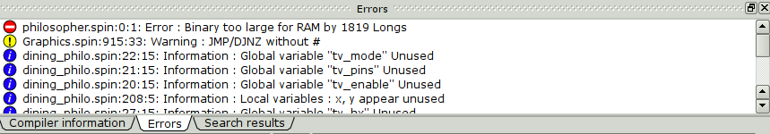

.. vim: textwidth=80 :

.. _compilation:

Compilation and program loading
-------------------------------

    Compilation is always started from current file. If you are working with
    multiple files, before compilation remember to switch to the file containing
    the start method of your program.

All compilation-related operations are available from **Compile** menu.

**Detect Propeller**  detects if Propeller is connected to computer's serial port
specified in  :ref:`Preferences dialog <settings>`. The result is displayed in
the status line:

.. image:: images/searchprop.png
    :width: 50%
    :align: center

Compilation and error messages
^^^^^^^^^^^^^^^^^^^^^^^^^^^^^^

To compile current file, use **Compile** command from **Compile** menu, also
accessible using *F9* shortcut. After compilation, a message is displayed on the
right of the status bar. After successfull compilation, **Compiled** is
displayed. If the compilation ends with a fatal error, **Compile error** is
displayed. If there were no errors, but the compiler generated warnings or
information messages, status bar displays **Compile warning** or **Compile
note**. Warnings and notes can be suppressed in :ref:`Preferences dialog <settings>`.

**Errors** widget displays detailed information about compilation errors:

Error messages are sorted by severity: fatal errors are at the top of the list,
notes are at the bottom. For each error, file name, line number and message are
displayed. Double-clicking a line with error message opens corresponding files
in editor, with cursor at the line with error.

After successfull compilation, **Compiler information** widget displays
information about compiled application:

 * code size in bytes  and LONGs
 * variables size in bytes and LONGs
 * free memory size in bytes and LONGs
 * Propeller clock frequency
 * Propeller clock mode

Loading programs into Propeller and saving to file
^^^^^^^^^^^^^^^^^^^^^^^^^^^^^^^^^^^^^^^^^^^^^^^^^^
To load compiled program into Propeller, select **Compile and load RAM** or
**Compile and load EEPROM** from **Compile** menu, or use *F10* or *F11*
shortcuts. When these commands are invoked, first the program is compiled. If
the compilation is successfull, the compiled program will be loaded into
Propeller's RAM or EEPROM. The loading progress is displayed in the status bar.

If you want save compiled program into a file, use
**Compile and save BINARY file**  or
**Compile and save EEPROM file**  commands. After compilation, a file selection
dialog opens to choose file name to save. The only difference between *BINARY* and
*EEPROM* files is that *BINARY* is exactly same size as compiled program, and
*EEPROM* is padded with zeros to 32768 bytes.
