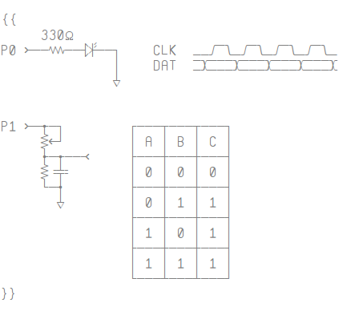
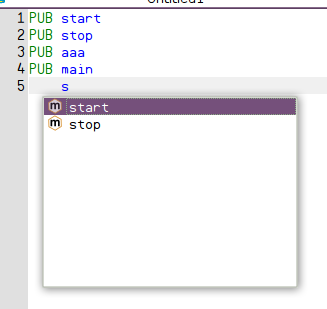
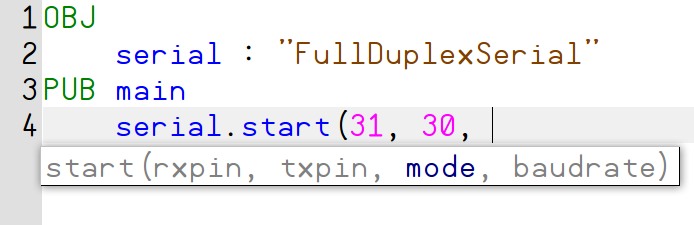

.. vim: textwidth=80 :

Editing files
-------------

Switching between open files
^^^^^^^^^^^^^^^^^^^^^^^^^^^^
In PZST, multiple files can be opened for editing. Several methods of switching
between open files are provided:

 * click on editor tab
 * select file name from **Window** menu
 * press *Ctrl+Tab* combination, and release *Tab*, keeping
   *Ctrl* press. A window appears with open files list. Each next press of
   *Tab*  key selects next file in the list. After releasing the *Ctrl* key,
   selected file's tab is activated.

Character table
^^^^^^^^^^^^^^^
**Character table**  widget allows to insert special character, such as lines,
arrows, etc., into program's text. This can be useful for drawing tables and
electrical diagrams. Click on a character in the widget to insert a character in
cursor position. The character table can be scrolled using the mouse wheel.

    Special characters examples

Indenting and dedenting
^^^^^^^^^^^^^^^^^^^^^^^
In SPIN programming language, program structure is defined with indents. When
editing program, a common task is increasing or decreasing indentation level of
a group of consecutive lines. To do so, select the lines, and press *Tab* for
intentation level increase, and *Shift+Tab* for decrease.

Quick methods navigation
^^^^^^^^^^^^^^^^^^^^^^^^

The toolbar displays a list of methods declared in current file. When navigating
thru file, list selection changes as cursor moves from one method to another. To
quickly navigate to a method definition, open the list by clicking it with the
mouse, and select the method from the list. Cursor will be moved to the first
line of method definition.

.. _autocomplete:

Autocomplete
^^^^^^^^^^^^
Autocomplete speeds up code editing by predicting the word that the user wants
to type in without the user actually typing it in completely. In PZST,
autocomplete works for methods, constants, objects and assembly labels.

To activate the autocomplete, press *Ctrl+.*. For example, if current file
declares methods *start*, *stop* and *str*, typing *s* and pressing *Ctrl+.*
displays a list with these methods. After selecting a method using arrow keys,
and pressing *Enter*, input is completed with the method selected.

    Autocomplete

Autocomplete list depends on current context. For example, when completing a
method name from an included object, only **PUB** methods are available.

Autocomplete list can appear not only when pressing *Ctrl+.*, but also
automatically when typing **.** or **#**. For example, after typing *serial.*, a
list of **PUB** methods from *serial* object is displayed.

.. _calltips:

Call tips
^^^^^^^^^

After typing a method name and opening bracket, PZST displays a popup window
displaying the method's arguments list. The first argument is highlighted. As
you type in arguments and commas, next arguments are highlighted. Call tip can
be also activated manually by pressing *Ctrl+Shift+.*.

    Call tips

