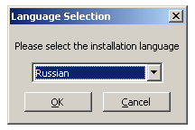
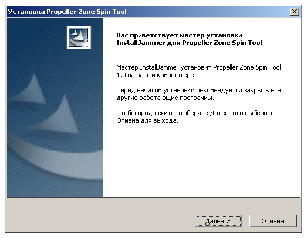
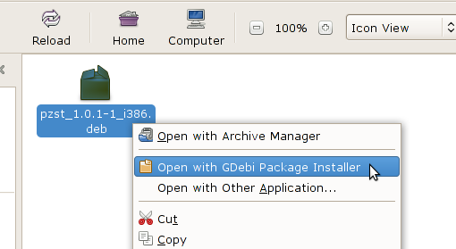
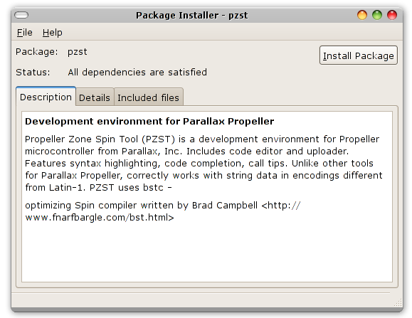
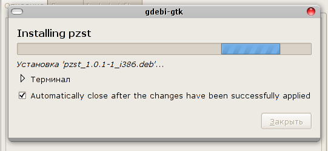
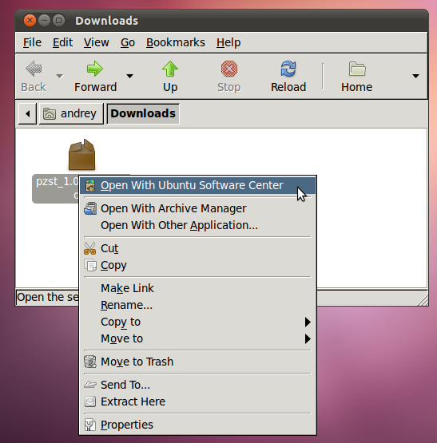
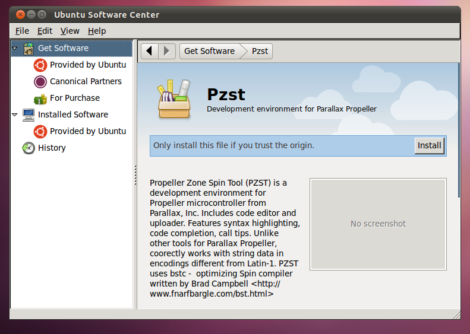

.. vim: textwidth=80 :

Installation
============

The latest software version can be downloaded from `projects's page on Google
Code <http://code.google.com/p/pzst/downloads/list>`_. Currently supported
operating systems are Microsoft Windows (XP and newer) and GNU/Linux.

Microsoft Windows
-----------------

Download and run the file named *PZST-x.y-Setup.exe* (where *x.y* is version number).
The installer suggests to choose installation language

After language selection, just press "Next" button, and then press "Finish".
After installation, the software can be started using the "Start" menu.

Linux
-----

"Official" builds for Linux are packaged as "deb" files for x86 processors, and can
be installed in Debian GNU/Linux and other Debian-based systems, such as Ubuntu.
To install the software in these systems, download the file named *pzst_x.y.z-1_i386.deb*,
where *x.y.z* is version number. 

These installation instructions suggest a typical Linux system, and can slightly
vary depending on installed packages and system configuration.

In both Debian and Ubuntu, PZST can be installed from terminal window using the following
commands (given the package file is saved to */tmp*):

::

    cd /tmp/
    sudo dpkg -i pzst_x.y.z-1_i386.deb

Read the following subsections if you prefer using graphical interface to
install the software.

Debian
^^^^^^

Open the folder conatining the downloaded package file. Then, right-click the package
file and choose "Open with GDebi Package Installer" from pop-up menu.

A window with application description opens. Start the installation process with
"Install package" button.

You will be asked for administrative password. After passowrd entry, the
installation progress window will appear.

After installation is complete, PZST can be starting using main menu
"Applications", "Programming" sumbenu.

Ubuntu
^^^^^^

Using the file manager, open the folder containing downloaded package file. If
you were using Firefox to download the package, in most cases it would be placed
to "Dowdnloads" folder. It can be opened by choosing  "Places - Downloads" from
main menu. In file manager window, right-click the package file icon, and choose
"Open with Ubuntu Software Center".

Software Center window displays the application information. Start the
installation process with "Install" button.

You will be asked for administrative password. After passowrd entry, the
installation process begins. Software Center may need to download and install
additional package files. This may take some time, there is no visual indication
of installation progress. After installation is completed, the Software Center
window displays "Installed" message.
PZST can be starting using main menu "Applications", "Programming" sumbenu.

Mac OS X
--------

Currently, binary releases for Mac OS X are not available. Although
program can be compiled under Mac OS X, some problems have been identified
that make PZST not fully functional in this operating system.
Work is underway to address the identified problems, but it is not possible to
tell the expected release date.
