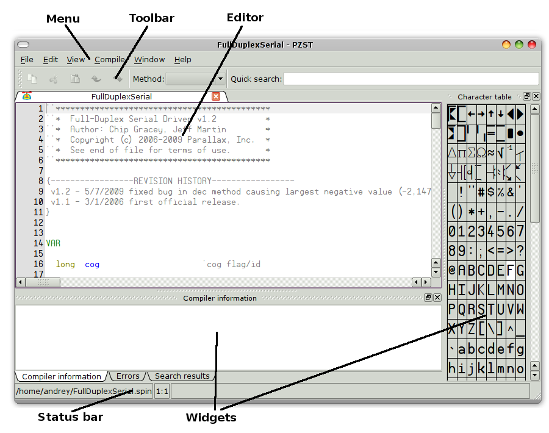

.. vim: textwidth=80 :

Workspace overview
--------------------

    PZST workspace

Central part of the window contains the code editor. Multiple source files can
be opened simultaneously, and switched using tabs.

At the window top, menu and toolbar are located. The menu provides access to all
program functions. Some menu items have associated shortcuts - keyboard
combinations used to quickly execute corresponding actions. For more details
about menu structure and shortcuts, see appropriate manual sections. The toolbar
provides quick access to most used editor functions. Also, the toolbar contains
current object's methods list, and quick search line.

The editor area is surrounded by `widgets` - small windows
displaying different information and allowing to execute actions:

 * search results - displays list of serach term matches in single or multiple
   files
 * compiler information - ater successfull compilation, displays program
   information - code size, variables size, free memory etc.
 * errors - displays list of compilation errors
 * character table - allows to insert special characters into the program code,
   for example for tables of electrical diagrams

Ant widget can be removed from the screen by clicking its close button. Also,
any widget can be placed at any side of editor area, bu dragging the widget's
title bar.

Status bar is located at the bottom of PZST window. When editing files, the
status bar displays current file name and cursor position. When compiling and
downloading program, the status bar also displays messages and progress
indicator.
