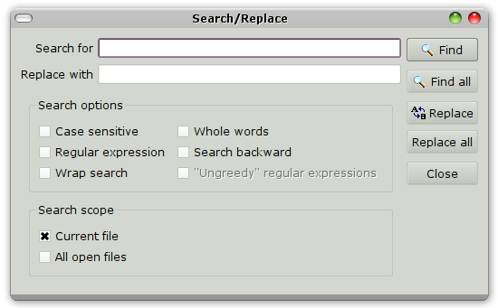

.. vim: textwidth=80 :

.. _searching:

Search and replace
------------------

Search can be performed using **Search/Replace** dialog, activated by *Ctrl+F*
shortcut.

.. _figure_find:

    **Sarch/Replace** dialog

**Search for** field is used to specify the search term. After pressing **Find**
button, the search will be performed. Matching text will be highlighted in
editor window. The search dialog stays open, and pressing **Find** again will
find the next match.

**Find all** button searches all matches of search term in either current
document, or all open files, depending on **Search scope** options.

**Replace** button replaces the found text with text from **Replace with**
field. **Replace all** button replaces all occurences of found text. Replace is
only performed in current document.

**Search options** can be used to change search/replace behavior:

 * **Case sensitive** : when this option is set, search is sensitive to upper/lower case,
   and *start*  search term finds *start*, but not *Start*.
   When this option is not set, *start* finds *start*, *Start* and *START*
 * **Whole words** : when this option is set, only full words matchin the search
   term will be found. For example, *start* finds *start*, but not *starting*.
   When this option is not set, *start* finds both *start* and *starting*
 * **Search backward** : Changes search direction. When this option is not set,
   search is performed from cursor to ducument end ("forward"), when the option is
   set - from cursor to document start ("backward")
 * **Wrap search** : if this option is not set, search completes when end of
   ducument (when searching forward) or start of document (when searchin
   backward) is reached. When the option is set, search is wrapped : it will
   continue from start of ducument when searching forward, of from end of
   document when searchin backward
 * **Regular expressions** : when this option is set, contents of
   **Search for**  is interpreted not as literal text, but rather as a 
   *regular expression*. Regular expressions are text patterns used to perform
   text search. When this option is set, the contents of **Replace with** input
   are also interpreted in a special way. For details about regular expressions,
   see :ref:`regexp`
 * **"Ungreedy" regular expressions** - modifies regular expressions behavior.
   For details see :ref:`regexp`

