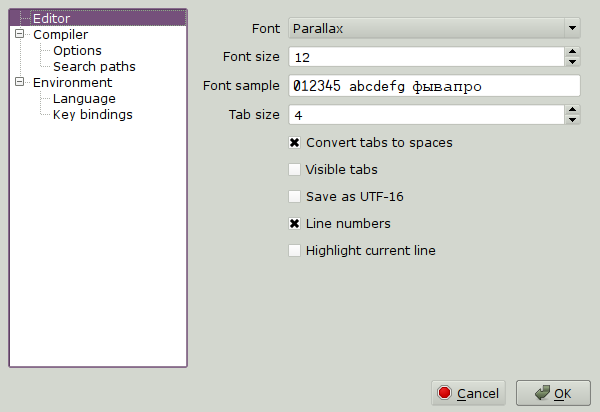

.. vim: textwidth=80 :

.. _settings:

Software configuration
======================

Software configuration is performed using the **Preferences** dialog.
Use **Preferences** command from **Edit** menu to open the dialog.

At the left of the dialog, categories list is located. When choosing a category
from the list, the right part of the dialog displays corresponding options.

Editor options
^^^^^^^^^^^^^^

 * **Font** - font used in code editor
 * **Font size** - editor's font size
 * **Font sample** - displays selected font's sampel
 * **Tab size** - number of space characters used to represent tab character
 * **Convert tabs to spaces** - if this option is set, pressing *Tab* inserts
   spsces into text (number of spaces in set with **Tab size** option),
   otherwise TAB character is inserted
 * **Visible tabs** - when this option is set, lines of text with equal
   indentation level are connected with dashed lines. This helps to visualize
   the structure of SPIN programs.
 * **Save as UTF-16** - when this option is set, editor files are saved using
   UTF-16 encoding, otherwise UTF-8 is used
 * **Line numbers** - display line numbers
 * **Highlight current line** - highlight current line in editor

Compiler options
^^^^^^^^^^^^^^^^

Options in this category control the compiler behavior. Most of these options
are related to code optimization. If none of optimization options are set,
generated code is identical to that of **Propeller/Spin Tool**  from
Parallax.

 * **Encoding** - character encoding for string constants.
   One of disdvantages of other tools for Propeller programming is inablity to
   use character encodings other than *Latin-1*. PZST solves this problem - 
   character constants will use encoding specified in program preferences.
 * **Fold constants** - when this option is set, constant expressions are
   evaluated during compilation. This generates faster and smaller code
 * **Fold Constant/Unary pairs** - speeds up evaluation of *--CONST* expressions
 * **Generic "Safe" optimizations** - optimisations for smaller/faster code,
   resulting code is different from what the Parallax compiler will generate
 * **"Fast" constants** - generates faster code for constants evaluation, at the
   cost of bigger code size
 * **Non-Parallax compatible extensions** - when this option is set, conditional
   compilation directives can be used (*#ifdef*,  *#ifndef*)
 * **Generate Warning messages** - include compiler warning messages in errors
   list
 * **Generate Info messages** - include compiler notes in errors list

Search paths
^^^^^^^^^^^^

Search paths are a list of directories searched for files included by  *OBJ*
directives. First, the main object's directory is searched. If file is not found
there, search paths are examined in the order defined in **Preferences** dialog.

To add a directory to search path, click the **Add** button, and select a
directory from file dialog. To remove a directory, select it in the list, and
click **Remove**. Directories in the list can be reordered by clicking **Up**
and **Down**.

Language
^^^^^^^^

This option changes user interface language. After selecting a new language the
software must be restarted for change to take effect.

Key bindings
^^^^^^^^^^^^

This page allows to redefine shortcuts for most of the actions.

The list on this page displays action names, descriptions and assigned
shortcuts. Up to 3 alternative shortcuts can be assigned to each action, using 3
inputs below the list. After a command is selected from the list, these inputs
are filled with current shortcuts. To assign a new shortcut, select one of the
three shortcut inputs using the mouse, and press desired keys combination.

    For any action, you can assign either single shortcut, or shortcuts
    sequence. Examples of single shortcuts:  *Ctrl+S* or *Alt+Shift+U*.
    Shortcuts sequence example : *Alt+S, E*, meaning *Alt+S* followed by *E*.

*Clear* button is used to clear selected shortcut.
*Revert* button reverts shortcut to original state.
