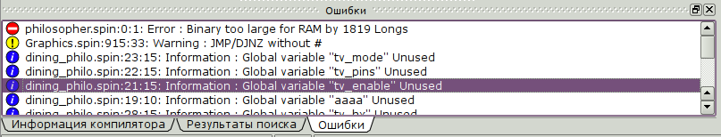

.. vim: textwidth=80 :

.. _compilation:

Компиляция и загрузка программ
------------------------------

.. ATTENTION::

   Компилируется всегда текущий файл. Если вы работаете с несколькими файлами,
   перед компиляцией не забывайте переключаться на файл, содержащий стартовую
   функцию, с которой начнется выполнение программы.

Все операции по компиляции и загрузке программ доступны в меню **Компиляция**.

Команда **Найти Пропеллер** позволяет определить, подключен ли Пропеллер к
компьютеру.  При вызове этой команды с помощью меню или клавишей *F7*,
производится поиск Пропеллера на последовательном порту, указанном  в :ref:`диалоге
конфигурации <settings>`. Результат поиска отображается в строке состояния.

Компиляция и сообщения об ошибках
^^^^^^^^^^^^^^^^^^^^^^^^^^^^^^^^^

Для компиляции текущего файла, нужно вызвать команду **Скомпилировать** с
помощью меню или клавишей *F9*. После компиляции, в правой части строки
состояния отображается сообщение. Если компиляция прошла успешно, будет выведено
сообщение **Скомпилировано**. При наличии критических ошибок, выводится **Ошибка
компиляции**. Если при компляции ошибо не было, но компилятор выдал
предупреждения, выводится сообщение **Предупреждение компилятора** или
**Замечание компилятора**. Выдачу предупреждений и замечаний можно подавить в :ref:`диалоге
конфигурации <settings>`.

Детальная информация об ошибках отображается в виджете **Ошибки**

Сообщения отсортированы по важности - вверху списка находятся критические
ошибки, внизу - замечания. Для каждой ошибки отображается имя файла, номер
строки, и сообщение. При двойном щелчке по строке с ошибкой, будет открыт
соответствующий файл, с курсором в строке с ошибкой.

После успешной компиляции, в виджете **Информация компилятора** отображаются
сведения о скомпилированной программе:

 * Размер кода в байтах и 32-битных словах
 * Размер переменных в байтах и 32-битных словах
 * Размер свободной памяти в байтах и 32-битных словах
 * Выбранная тактовая частота
 * Режим тактирования контроллера

Загрузка программ в микроконтроллер и запись в файл
^^^^^^^^^^^^^^^^^^^^^^^^^^^^^^^^^^^^^^^^^^^^^^^^^^^

Загрузка программ в Пропеллер производится с помощью команд **Скомпилировать и
загрузить в ПЗУ** и **Скомпилировать и загрузить в ОЗУ** (клавиши *F10* и *F11*,
соответственно). При вызове этих команд, сначала выполняется компиляция точно
так же, как при нажатии *F9*. Если при компиляции не было критических ошибок,
будет выполнена загрузка программы в контроллер. Прогресс загрузки отображается
в строке состояния.

Если необходимо записать скомпилированную программу в файл, можно
воспользоваться командами **Скомпилировать и сохранить в файл EEPROM** и
**Скомпилировать и сохранить в файл BINARY**. После компиляции, будет запрошено
имя файла для сохранения. Разница между файлами *BINARY* и *EEPROM* в том, что
файл *BINARY* имеет размер в точности как скомпилированная программа, а файл
*EEPROM* дополняется нулями до размера 32768 байт.
