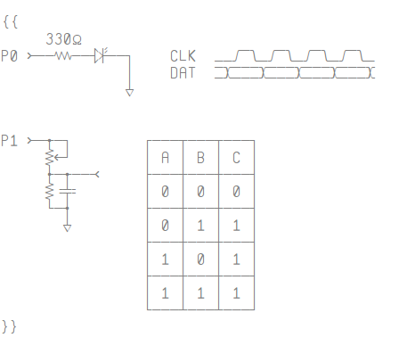
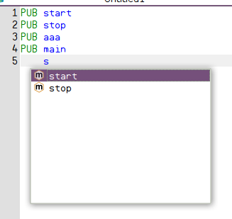
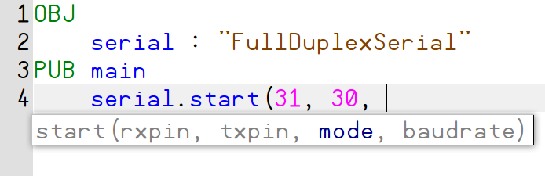

.. vim: textwidth=80 :

Редактирование файлов
---------------------

Переключение между файлами
^^^^^^^^^^^^^^^^^^^^^^^^^^
PZST позволяет одновременно открыть для редактирования несколько файлов и
переключаться между ними в процессе работы. Переключение можно выполнить
несколькими способами:

 * щелкнуть мышью по закладке с именем файла
 * выбрать имя файла из меню **Окно**
 * нажать комбинацию клавиш *Ctrl+Tab*, и отпустить клавишу *Tab*, продолжая
   удерживать клавишу *Ctrl*. Появится окно со списком открытых файлов. При
   каждом последующем нажатии клавиши *Tab*  будет выделяться имя следующего
   файла. Выбрав нужный файл, отпустить клавишу *Ctrl*

Таблица символов
^^^^^^^^^^^^^^^^
Виджет **Таблица символов** позволяет вставить в редактируемый файл специальные
символы, например для рисования таблиц или фрагментов электрических схем.
Вставка символа производится щелчком мыши по таблице символов. Символ
вставляется в позиции курсора. Таблицу символов можно прокручивать колесом мыши.

    Таблица символов

Увеличение и уменьшение отступа
^^^^^^^^^^^^^^^^^^^^^^^^^^^^^^^
В языке SPIN структура программы определяется отступами от начала
строки. Часто бывает необходимо увеличить или уменьшить уровень отступа сразу
для нескольких подряд идущих строк. Для этого можно выделить строки и нажать
*Tab* для увеличения отступа или *Shift+Tab* - для уменьшения.

Быстрая навигация по методам
^^^^^^^^^^^^^^^^^^^^^^^^^^^^

На панели инструментов имеется список методов текущего файла. При перемещении
курсора по файлу, в списке выбирается метод, в котором находится курсор. Для
быстрого перехода к началу метода, нужно развернуть список щелчком мыши и
выбрать метод из развернутого списка. Курсор будет установлен на первую строку
метода.

.. _autocomplete:

Автозавершение
^^^^^^^^^^^^^^
Функция автозавершения позволяет автоматически завершить ввод после набора части 
имени метода, объекта или константы. Это позволяет сделать работу более
продуктивной. Для активации функции автозавершения нужно нажать комбинацию
клавиш *Ctrl+Space* FIXME. Например, если в текущем файле определены методы *start*, 
*stop* и *str*, при вводе *s* и нажатии *Ctrl+Space* FIXME будет выведен список с
именами этих методов. Нужный метод можно выбрать с помощью клавиш управления
курсором. При нажатии *Enter* ввод будут завершен именем, выбранным из списка.

    Автозавершение

Список автозавершения зависит от текущего контекста. Например, при
автозавершении имени метода  подключенного объекта будут доступны только
методы **PUB**.

Список автозавершения может появляться не только при нажатиии *Ctrl+Space*, но и
автоматически при вводе символов "**.**" и "**#**". Например, если ввести
*serial.*, появится список **PUB** - методов объекта *serial* (если он был
объявлен в секции **OBJ**).

.. _calltips:

Подсказки об аргументах функции
^^^^^^^^^^^^^^^^^^^^^^^^^^^^^^^

После ввода имени существующего метода и открывающей скобки, появляется
всплывающее окно со списком аргументов метода. Первый аргумент метода будет
подсвечен.  По мере ввода, будут подсвечиваться следующие аргументы. Подсказку
можно вызвать в любой момент, нажав комбинацию клавиш *Ctrl+Shift+Space* FIXME.
Подсказки доступны как для методов текущего объекта, так и для методов
объектов, объявленных в секции **OBJ**.

    Подсказка аргументов

