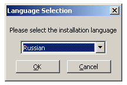
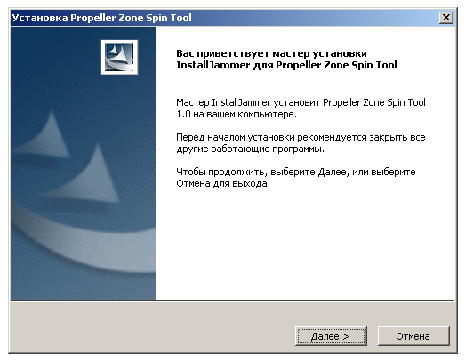
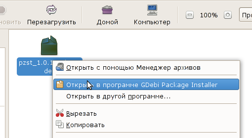
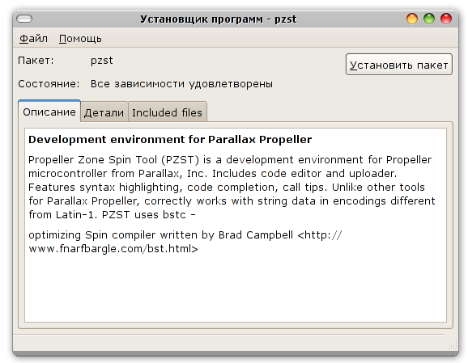
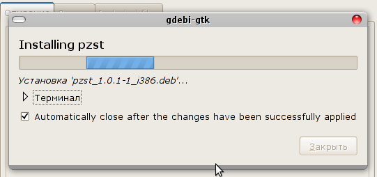
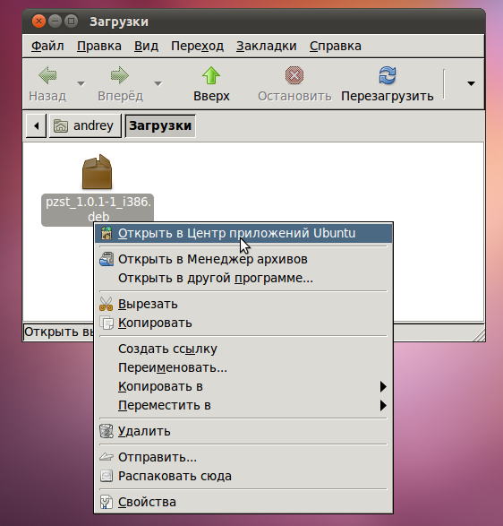
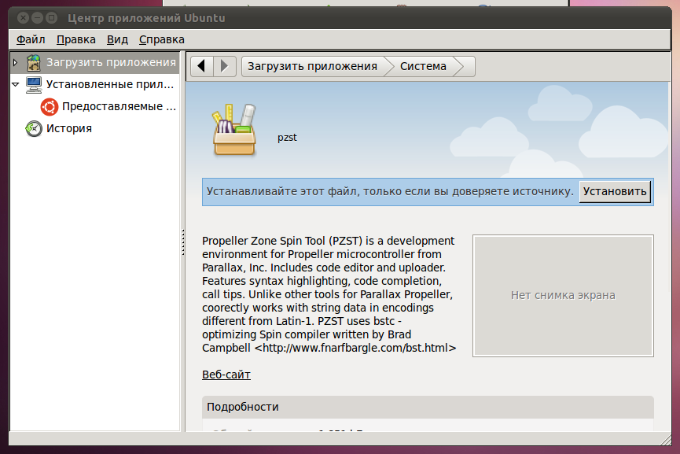

.. vim: textwidth=80 :

Установка
=========

Последнюю версию программы можно скачать с `сайта проекта
<http://code.google.com/p/pzst/downloads/list>`_. В настоящее время
поддерживаются операционные системы Microsoft Windows (XP и более поздние
версии) и GNU/Linux.

Microsoft Windows
-----------------

Необходимо скачать и запустить файл *PZST-x.y-Setup.exe* (где *x.y* - это номер версии
программы). Программа установки предложит выбрать язык, который будет
использован для вывода сообщений.

Затем нужно просто несколько раз нажать кнопку
"Далее", а затем "Готово" для завершения установки. После окончания установки,
программу можно будет запустить с помощью меню "Пуск".

Linux
-----

"Официальные" сборки для Linux выпускаются в формате пакетов "deb", для
процессоров x86, и могут быть установлены в Debian GNU/Linux и других
системах, основанных на Debian, например Ubuntu. Для установки программы PZST в
этих системах, необходимо скачать файл пакета *pzst_x.y.z-1_i386.deb*, где *x.y.z* -
номер версии программы. 

Инструкции по установке приведены для типичной системы, и могут незначительно
отличаться для вашей системы, в зависимости от установленных программ и
настроек системы.

И в Debian, и в Ubuntu установить PZST  можно из терминала, выполнив следующие
команды (предполагается, что файл пакета записан в */tmp*):

::

    cd /tmp/
    sudo dpkg -i pzst_x.y.z-1_i386.deb

Если Вы предпочитаете использовать графический интерфейс, а не командную строку
- читайте следующие подразделы.

Debian
^^^^^^

Откройте папку, содержащую файл, с помощью менеджера файлов.
в главном меню. Затем, щелкните правой кнопкой мыши по файлу, и выберите пункт
меню "Открыть в программе GDebi Package Installer".

Откроется окно с информацией о программе. Начать установку можно нажатием кнопки
"Установить пакет".

Будет запрошен пароль администратора, после ввода которого начнется процесс
установки, ход которой отображается в открывшемся окне.

По завершении установки, запустить программу можно из главного меню "Приложения",
подменю "Программирование".

Ubuntu
^^^^^^

Откройте папку, содержащую файл, с помощью менеджера файлов. Если вы
использовали браузер Firefox для скачивания файла, в большинстве случаев он
будет помещен в папку "Загрузки". Для ее открытия можно выбрать "Переход - Загрузки"
в главном меню. Затем, щелкните правой кнопкой мыши по файлу, и выберите пункт
меню "Открыть в Центр приложений Ubuntu".

Откроется окно программы "Центр приложений" с описанием программы. Для начала
установки нажмите кнопку "Установить".

Будет запрошен административный пароль, после ввода которого начнется установка.
Этот процесс займет некоторое время, после чего в окне Центра приложений появится
сообщение "Установлено". Запустить программу можно из главного меню "Приложения",
подменю "Программирование".

Mac OS X
--------

В настоящее время бинарные релизы программы под OS X не выпускаются. Хотя
программа и может быть скомпилирована под Mac OS X, были выявлены проблемы,
которые не позволяют говорить, что **PZST** полностью работоспособна в этой
операционной системе. Ведется работа по решению выявленных проблем, но назвать
ожидаемую дату выпуска не представляется возможным.

