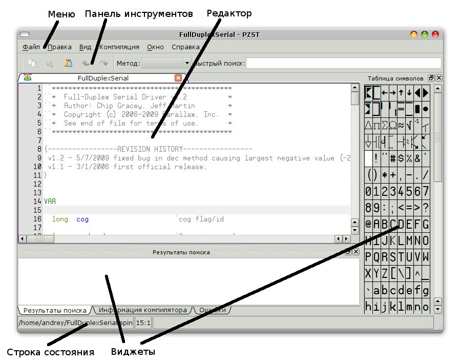

.. vim: textwidth=80 :

Обзор рабочего места
--------------------

В центральной части окна программы расположена область редактирования. В ней
располагется редактор исходного кода. Можно открыть для редактировния несколько
файлов и переключаться между ними с помощью закладок.

В верхней части окна расположены строка меню и панель инструментов. Меню
обеспечивает доступ ко всем функциям программы. Некоторые пункты меню имеют
"горячие клавиши" - комбинации клавиш, при нажатии которых выполняется
соответствующее действие. Подробнее о структуре меню и "горячих клавишах"
смотрите в соответствующих разделах. Панель инструментов обеспечивает быстрый
доступ к наиболее часто используемым функциям редактора. Также на панели
инструментов расположены список методов текущего файла, и строка быстрого поиска.

Вокруг области редактирования распологаются `виджеты` - небольшие окна,
отображающие различную информацию или позволяющие выполнить какие-либо действия:

 * результаты поиска - отображает список соответствий при поиске по одному или
   нескольким файлам
 * информация компилятора - после успешной компиляции отображает различную
   информацию о программе - размер кода, размер переменных, свободная память и
   т. д.
 * ошибки - при наличии ошибок компиляции в этом виджете появляется список
   ошибок
 * таблица символов - позволяет вставить в код программы специальные символы,
   например для рисования таблиц или электрических схем

Любой виджет можно удалить с экрана, нажав на кнопку закрытия. Также виджеты
можно перетаскивать за строку заголовка с помощью мыши, помещая их с любой
стороны от области редактирования.

В нижней части окна расположена строка состояния. В режиме редактирования
она отображает имя текущего файла, а также номер текущей строки и позицию
курсора в строке. При компиляции и загрузке программ в строке состояния
отображаются также информационные сообщения и индикатор прогресса.
