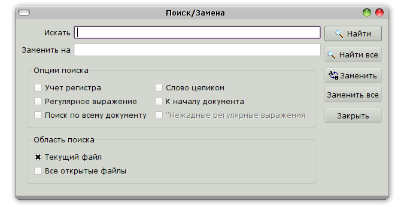

.. vim: textwidth=80 :

.. _searching:

Поиск и замена
--------------
Поиск в тексте программы можно выполнить с помощью дилога **Поиск/Замена**,
вызвав его нажатием комбинации клавиш *Ctrl+F*.

.. _figure_find:

    Диалог "Поиск/Замена"

Текст для поиска вводится в поле **Искать**. При нажатии кнопки **Найти**, будет
произведен поиск в текущем документе. Найденный фрагмент текста будет выделен.
Диалог при этом не закрывается, и нажав кнопку **Найти** снова, можно продолжить
поиск.

При нажатии кнопки **Найти все**, будет осуществлен поиск либо по текущему
документу, либо по всем открытым файлам, в зависимости от опций **Область поиска**.

Кнопка **Замена** предназначена для замены найденного фрагмента текста. Тект для
замены вводится в поле **Заменить на**. Нажатием на кнопку **Заменить все**
можно заменить все найденные фрагменты. Замена производится только в текущем
файле.

Изменить параметры поиска можно с помощью флагов в разделе **Опции поиска**:

 * **Учет регистра** : если этот флаг установлен, прописные и строчные буквы
   различаются. Например, строка поиска *start* найдет *start*, но не *Start*.
   При снятом флаге, *start*, *Start* и *START* не различаются
 * **Слово целиком** : при установке этого флага будут искаться слова, целиком
   совпадающие со строкой поиска. Например, есле в тексте присутствуют слова
   *start* и *starting* и задана строка поиска *start*, при снятом флаге будут
   найдены оба слова, а при установленном -- только *start*
 * **К началу документа** : изменяет направление поиска. При снятом флаге, поиск
   ведется от курсора к концу документа (поиск "вперед"), при установленном --
   от курсора к началу документа (поиск "назад")
 * **Поиск по всему документу** : если этот флаг снят, поиск прекращается при
   достижении конца (при поиске вперед) или начала (при поиске назад) документа.
   Если установить этот флаг, то поиск будет "зациклен" -- поиск продолжится с
   начала документа при поиске вперед, и с конца -- при поиске назад.
 * **Регулярные выражения** : при установке этого флага, содержимое поля
   **Искать** интерпретируется не как простой текст, а как *регулярное выражение*.
   Регулярные выражения -- это шаблоны, по которым производится поиск текста.
   При установке этого флага, содержимое поля **Заменить на** также
   интерпретируется специальным образом. Подробнее см. :ref:`regexp`
 * **"Нежадные" регулярные выражения** - изменяет режим работы регулярных
   выражений. Подробнее см. :ref:`regexp`

