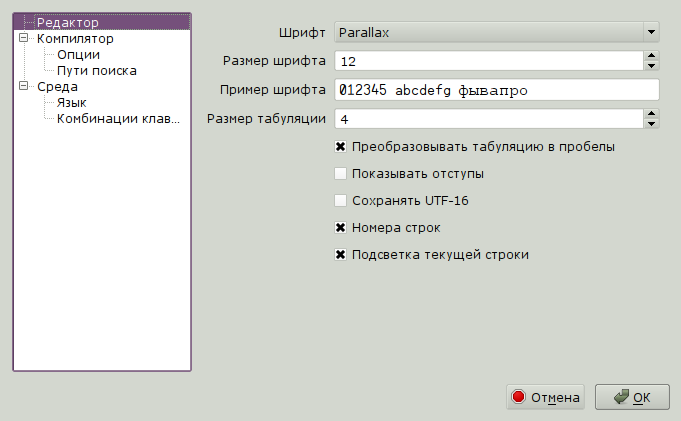

.. vim: textwidth=80 :

.. _settings:

Настройка программы
===================

Настройка программы производится в диалоге **Параметры**. Диалог вызывается
одноименной командой в меню **Правка**.

В левой части диалога расположен список категорий. При выборе категории, в правой
части диалога выводятся соответствующие опции.

Опции редактора
^^^^^^^^^^^^^^^

 * **Шрифт** - шрифт используемый в редакторе кода
 * **Размер шрифта** - размер шрифта редактора
 * **Пример шрифта** - отображает пример выбранного шрифта
 * **Размер табуляции** - количество символов, соответствующих символу табуляции
 * **Преобразовывать табуляцию в пробелы** - если эта опция выбрана, при нажатии
   клавиши *Tab* в текст вставляются пробелы (число пробелов задается опцией
   **Размер табуляции**), иначе - вставляется символ табуляции
 * **Показывать отступы** - при установке этой опции, строки текста с одинаковым
   уровнем отступа от начала строки будут соединены пунктирными лниями. Это
   помогает видеть структуру программы на языке Spin.
 * **Сохранять UTF-16** - при выборе этой опции, файлы будут сохраняться в
   кодировке UTF-16, иначе - UTF-8
 * **Номера строк** - отображать номера строк
 * **Подсветка текущей строки** - выделять цветом текущую строку

Опции компилятора
^^^^^^^^^^^^^^^^^

Эта группа опций управляет поведением компилятора. В основном эти опции касаются
оптимизации кода. Если ни одна из опций оптимизации не выбрана, генерируемый код
идентичен коду, который создает компилятор **Propeller/Spin Tool** компании
Parallax.

 * **Кодировка** - кодировка, в которую преобразовывать строковые константы.
   Одним из недостатков других сред программирования Пропеллера является
   невозможность использовать кодировки, отличные от *Latin-1*, то есть они
   позволяют использовать в строкахтолько базовые английские символы и символы
   заподноевропейских языков. PZST решает эту проблему - строковые константы в
   программе будут в кодировке, указанной в настройках программы
 * **Упрощение констант** - при выборе этой опции, выражения, содержащие только
   константы, будут вычисляться на этапе компиляции. Это позволяет уменьшить
   размер программы и увеличить скорость выполнения
 * **Упрощение пар константа/унарный опреатор** - ускоряет вычисление выражений
   вида *--CONST*
 * **Общие "безопасные" оптимизации** - использовать различные приемы
   оптимизации, уменьшающие размер кода и ускоряющие выполнение программы
 * **"Быстрые" константы** - генерировать более быстрый код для работы с
   константами, за счет увеличения размера кода
 * **Расширения несовместимые с компилятором Parallax** - при включении этой
   опции в коде можно использовать директивы условной компиляции *#ifdef*,
   *#ifndef*
 * **Показывать предупреждения** - отображать предупреждения компилятора в
   списке ошибок
 * **Показывать информационные сообщения** - отображать замечания компилятора в
   списке ошибок

Пути поиска
^^^^^^^^^^^

Пути поиска - это список директорий, в которых компилятор ищет файлы объектов,
подключенных в секции *OBJ*. В первую очередь файл ищется в той же директории,
где находится главный файл программы. Если там файл не найден, то
просматриваются пути поиска в том порядке, в котором они заданы в диалоге
**Параметры**.

Для добавления каталога в путь поиска используется кнопка **Добавить**.
Открывается диалог выбора каталога. Удалить каталог из пути поиска можно,
выделив его в списке и нажав кнопку **Удалить**. Изменить порядок каталогов в
пути поиска можно с помощь. кнопок **Вверх** и **Вниз**

Язык
^^^^

Здесь можно изменить язык интерфейса, выбрав его из списка. После изменения
языка нужно перезапустить программу.

Комбинации клавиш
^^^^^^^^^^^^^^^^^

На этой странице можно переопределить "горячие клавиши" для различных действий.

В списке отображаются условные названия действий, их описания, и комбинации
клавиш. Для каждого действия можно задать до трех комбинаций клавиш. Для этого
служат три поля ввода под списком. После выбора команды из списка, эти поля
заполняются текущими комбинациями. Для задания комбинации, нужно выбрать одно из
полей ввода мышью, и нажать комбинацию клавиш.

.. ATTENTION::

    Для каждого действия можно задать отдельную комбинацию клавиш или
    последовательность комбинаций. Отдельная комбинация - это например *Ctrl+S*
    или *Alt+Shift+U*. Последовательность комбинаций - это например *Alt+S, E*,
    что означает последовательность - сначала *Alt+S*, потом *E*.

Кнопка **Очистить** служит для очистки поля ввода, в котором находится курсор.
Кнопка **Восстановить** возвращает комбинацию клавиш к исходному состоянию.

